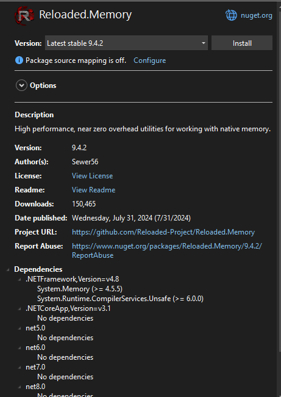
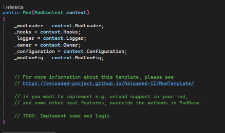

# How to Create a runtime memory patch with Reloaded 2
## This is manly focused for the Lego Modding Community as most people seem to only know how to edit the games executable with a hex editor.

I wont explain much on the setup side because if you cant figure this part out on your own then just stop reading as it gets more complex then this.

(i wont explain how to install an IDE, Reloaded 2 or NuGet (just use google to learn how to install a nuget package)

Setup Reloaded 2 and your IDE of choice to use the reloaded extension, my preference is Visual Studio 2022
Read [THIS!](https://reloaded-project.github.io/Reloaded-II/DevelopmentEnvironmentSetup/)
if you want to learn the basics of c# quickly then go and check out https://www.w3schools.com/cs/index.php

## 1. Create a reloaded 2 mod project

This is the template you will select, you will then need to give the project a name (part of the general project setup not reloaded 2)
After giving it a project name you will have to configure the Reloaded 2 options, this include the mod name, description, creator(s), and if it will have Github support and Mod Config support.
## 2. Install the Reloaded.Memory Nuget

## 3. Open Mod.cs
the code inside mod.cs will look like this...

here we will write the code to create a patch in the memory when the game starts
## 4. Actual coding now
you can get lazy and do this in the constructor or you can do this in its own method like i am.

I will now show you the simplest way to create a simple patch then i will explain each part of it

First you will need to add the following to access everything needed without using the namespaces
```cs
using Reloaded.Memory; 
using System.Diagnostics; 
using Reloaded.Memory.Interfaces;
```
Next you will need to create a method that is called in the constructor, i named my method "Patch"
```cs
public Mod(ModContext context)
{
    _modLoader = context.ModLoader;
    _hooks = context.Hooks;
    _logger = context.Logger;
    _owner = context.Owner;
    _configuration = context.Configuration;
    _modConfig = context.ModConfig;

    // Patch the game by calling the method Patch
    Patch();
}

private void Patch()
{

}

```
In Patch you will want 2 variables

```cs
private void Patch()
{
	var m = Memory.Instance; // get the Instance of the memory class

	// get the base address of the process
	var baseAddress = Process.GetCurrentProcess().MainModule.BaseAddress; // get the base address of the process	
}
```

you will then need to call the method in the memory class instance to write to the games memory with the correct args
```cs
// allocate a stack memory of 1 byte and write the value 0x16 to it
Span<byte> bytes = stackalloc byte[1] { 0x16 }; // 0x16 is the value we want to write in hex format (22 in decimal)

nuint address = (nuint)baseAddress + 0xF79E3; // get the address of the value we want to change (0xF79E3 is the offset of the value we want to change) and cast it to nuint for the SafeWrite method

m.SafeWrite(address, bytes); // write the value 0x16 to the address 
```

you can also be a lunatic and do everything in 1 line like so
```cs
Memory.Instance.SafeWrite((nuint)Process.GetCurrentProcess().MainModule.BaseAddress + 0xF79E3, stackalloc byte[1] { 0x16 });
```

bringing everything together your entire Mod.cs file will look like this...
```cs
using My_Reloaded_II_Mod1.Configuration;
using My_Reloaded_II_Mod1.Template;
using Reloaded.Hooks.ReloadedII.Interfaces;
using Reloaded.Mod.Interfaces;
using Reloaded.Memory;
using System.Diagnostics;
using Reloaded.Memory.Interfaces;

namespace My_Reloaded_II_Mod1
{
    public class Mod : ModBase // <= Do not Remove.
    {
        private readonly IModLoader _modLoader;
        private readonly IReloadedHooks? _hooks;
        private readonly ILogger _logger;
        private readonly IMod _owner;
        private Config _configuration;
        private readonly IModConfig _modConfig;

        public Mod(ModContext context)
        {
            _modLoader = context.ModLoader;
            _hooks = context.Hooks;
            _logger = context.Logger;
            _owner = context.Owner;
            _configuration = context.Configuration;
            _modConfig = context.ModConfig;

            // Patch the game
            Patch();
        }

        private void Patch()
        {
            var m = Memory.Instance; // get the Instance of the memory class

            // get the base address of the process
            var baseAddress = Process.GetCurrentProcess().MainModule.BaseAddress; // get the base address of the process

            // another longer way to get the base address of the process in a more readable way
            /*
            var process = Process.GetCurrentProcess(); // get the current process
            var mainModule = process.MainModule; // get the main module of the process
            var baseAddress2 = mainModule.BaseAddress; // get the base address of the main module
            */

            // allocate a stack memory of 1 byte and write the value 0x16 to it
            Span<byte> bytes = stackalloc byte[1] { 0x16 }; // 0x16 is the value we want to write in hex format (22 in decimal)

            nuint address = (nuint)baseAddress + 0xF79E3; // get the address of the value we want to change (0xF79E3 is the offset of the value we want to change) and cast it to nuint for the SafeWrite method

            m.SafeWrite(address, bytes); // write the value 0x16 to the address 
        }

        #region Standard Overrides
        public override void ConfigurationUpdated(Config configuration)
        {
            // Apply settings from configuration.
            // ... your code here.
            _configuration = configuration;
            _logger.WriteLine($"[{_modConfig.ModId}] Config Updated: Applying");
        }
        #endregion

        #region For Exports, Serialization etc.
#pragma warning disable CS8618 // Non-nullable field must contain a non-null value when exiting constructor. Consider declaring as nullable.
        public Mod() { }
#pragma warning restore CS8618
        #endregion
    }
}
```
you can now build the project and it should be automatically moved to the Reloaded Mods folder


## Here is my full Mod.cs without comments
```cs
using My_Reloaded_II_Mod1.Configuration;
using My_Reloaded_II_Mod1.Template;
using Reloaded.Hooks.ReloadedII.Interfaces;
using Reloaded.Mod.Interfaces;
using Reloaded.Memory;
using System.Diagnostics;
using Reloaded.Memory.Interfaces;

namespace My_Reloaded_II_Mod1
{
    public class Mod : ModBase // <= Do not Remove.
    {
        private readonly IModLoader _modLoader;
        private readonly IReloadedHooks? _hooks;
        private readonly ILogger _logger;
        private readonly IMod _owner;
        private Config _configuration;
        private readonly IModConfig _modConfig;

        public Mod(ModContext context)
        {
            _modLoader = context.ModLoader;
            _hooks = context.Hooks;
            _logger = context.Logger;
            _owner = context.Owner;
            _configuration = context.Configuration;
            _modConfig = context.ModConfig;

            Patch();
        }

        private void Patch()
        {
            var m = Memory.Instance;
            var baseAddress = Process.GetCurrentProcess().MainModule.BaseAddress;
            Span<byte> bytes = stackalloc byte[1] { 0x16 };
            nuint address = (nuint)baseAddress + 0xF79E3;
            m.SafeWrite(address, bytes); 
        }

        #region Standard Overrides
        public override void ConfigurationUpdated(Config configuration)
        {
            // Apply settings from configuration.
            // ... your code here.
            _configuration = configuration;
            _logger.WriteLine($"[{_modConfig.ModId}] Config Updated: Applying");
        }
        #endregion

        #region For Exports, Serialization etc.
#pragma warning disable CS8618 // Non-nullable field must contain a non-null value when exiting constructor. Consider declaring as nullable.
        public Mod() { }
#pragma warning restore CS8618
        #endregion
    }
}
```
