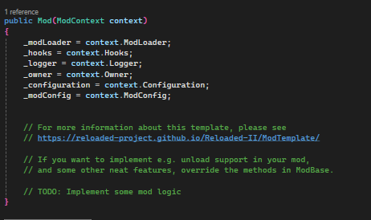

# How to Create a Runtime Memory Patch with Reloaded 2

## Introduction

This guide is primarily aimed at the LEGO Modding Community, where most members are familiar with editing game executables using a hex editor. This tutorial will teach you how to create a runtime memory patch using Reloaded 2, a more sophisticated approach.

### Prerequisites

This guide assumes you have a basic understanding of setting up your development environment. If you're not comfortable with setting up an IDE or installing Reloaded 2 or NuGet, I recommend searching online resources or tutorials for these initial steps. If you're unable to complete these prerequisites, this guide might be too advanced for you.

**Note:** I won't be covering the installation of an IDE, Reloaded 2, or NuGet packages. You can find installation instructions for these tools online. My preferred IDE is Visual Studio 2022.

### Resources

- [Reloaded 2 Development Environment Setup](https://reloaded-project.github.io/Reloaded-II/DevelopmentEnvironmentSetup/)
- If you're new to C#, I suggest learning the basics through [W3Schools C# Tutorial](https://www.w3schools.com/cs/index.php).

## 1. Create a Reloaded 2 Mod Project

Start by creating a new mod project in Reloaded 2. Select the appropriate template for your project.


After selecting the template, name your project as part of the general setup process (this is not specific to Reloaded 2). Next, configure the Reloaded 2 options, including the mod name, description, creator(s), GitHub support, and Mod Config support.

## 2. Install the `Reloaded.Memory` NuGet Package

Install the `Reloaded.Memory` package through NuGet, which is essential for memory manipulation.


## 3. Open `Mod.cs`

Locate and open the `Mod.cs` file in your project. Initially, it will look something like this:



This is where you'll write the code to create a memory patch that will be applied when the game starts.

## 4. Writing the Patch Code

You can choose to write the patching code directly in the constructor, or you can organize your code better by creating a separate method for it, which is the approach I'll demonstrate.

### this specific patch will expand the character grid (Thanks: Bario the Weird)

### Step-by-Step Code Breakdown

First, add the following using directives to access the necessary classes and methods without fully qualifying the namespaces:

```csharp
using Reloaded.Memory;
using System.Diagnostics;
using Reloaded.Memory.Interfaces;
public Mod(ModContext context)
{
    _modLoader = context.ModLoader;
    _hooks = context.Hooks;
    _logger = context.Logger;
    _owner = context.Owner;
    _configuration = context.Configuration;
    _modConfig = context.ModConfig;

    // Apply the patch
    Patch();
}

private void Patch()
{
    // Method implementation will go here
}
```


Within the `Patch` method, you need to define two key variables:

```cs
private void Patch()
{
    var m = Memory.Instance; // Get the instance of the Memory class

    // Retrieve the base address of the current process
    var baseAddress = Process.GetCurrentProcess().MainModule.BaseAddress;
}
```

To modify the game's memory, use the `SafeWrite` method provided by the `Memory` class:

```cs
// Allocate stack memory of 1 byte and write the value 0x16 to it
Span<byte> bytes = stackalloc byte[1] { 0x16 }; // 0x16 in hex (22 in decimal)

// Calculate the address to modify, using the base address and offset
nuint address = (nuint)baseAddress + 0xF79E3;

// Write the value 0x16 to the specified address
m.SafeWrite(address, bytes);

// this specific patch will expand the character grid (Thanks: Bario the Weird)
```

For those who prefer brevity, the entire patching process can be condensed into a single line of code:
```cs
Memory.Instance.SafeWrite((nuint)Process.GetCurrentProcess().MainModule.BaseAddress + 0xF79E3, stackalloc byte[1] { 0x16 });
```

### Final `Mod.cs` Implementation

Here's how the complete `Mod.cs` file should look:
```cs
using My_Reloaded_II_Mod1.Configuration;
using My_Reloaded_II_Mod1.Template;
using Reloaded.Hooks.ReloadedII.Interfaces;
using Reloaded.Mod.Interfaces;
using Reloaded.Memory;
using System.Diagnostics;
using Reloaded.Memory.Interfaces;

namespace My_Reloaded_II_Mod1
{
    public class Mod : ModBase // <= Do not remove.
    {
        private readonly IModLoader _modLoader;
        private readonly IReloadedHooks? _hooks;
        private readonly ILogger _logger;
        private readonly IMod _owner;
        private Config _configuration;
        private readonly IModConfig _modConfig;

        public Mod(ModContext context)
        {
            _modLoader = context.ModLoader;
            _hooks = context.Hooks;
            _logger = context.Logger;
            _owner = context.Owner;
            _configuration = context.Configuration;
            _modConfig = context.ModConfig;

            Patch();
        }

        private void Patch()
        {
            var m = Memory.Instance;
            var baseAddress = Process.GetCurrentProcess().MainModule.BaseAddress;
            Span<byte> bytes = stackalloc byte[1] { 0x16 };
            nuint address = (nuint)baseAddress + 0xF79E3;
            m.SafeWrite(address, bytes);
        }

        #region Standard Overrides
        public override void ConfigurationUpdated(Config configuration)
        {
            _configuration = configuration;
            _logger.WriteLine($"[{_modConfig.ModId}] Config Updated: Applying");
        }
        #endregion

        #region For Exports, Serialization, etc.
#pragma warning disable CS8618 // Non-nullable field must contain a non-null value when exiting constructor. Consider declaring as nullable.
        public Mod() { }
#pragma warning restore CS8618
        #endregion
    }
}
```

## Conclusion

After completing the code, you can build the project. The compiled files should automatically be moved to the Reloaded Mods folder. Congratulations, you've successfully created a runtime memory patch with Reloaded 2!
